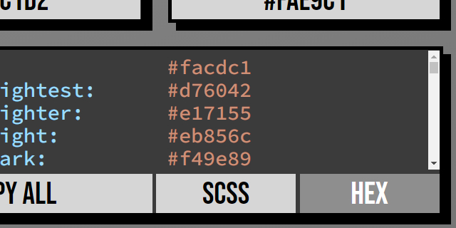
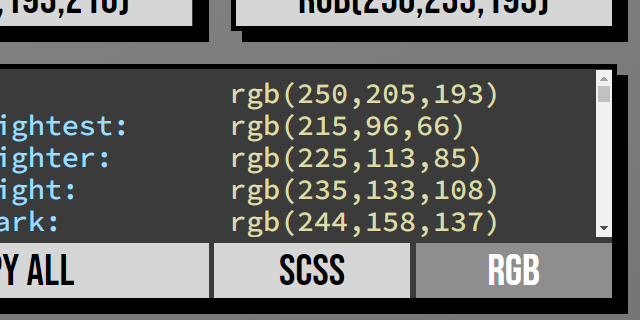

# GLD Colourmatic 5000
  
## Free palettes for everyone!
Accessibility is upfront and personal with subtle animation and intuitive design that can be used on all screen sizes and devices.
All controls can be accessed through keyboard, touch or mouse.  

## Contrast conscious?   
All swatches have a built in contrast ratio rating and automatic text-colour to keep your text readable.
Want to customise your text colour for lower contrast?   
  
Simply click the text button to choose a different colour and you can easily see if it conforms to the WCAG 2 contrast requirements.   

Tip: If you want to see what your chosen palette would look like in black and white simply drag the saturation slider all the way down.

## Instant inspiration, palatable palettes.  
  
Every time you load it up or click the 'Random' button, a new palette is generated automatically for you.   

## Click a colour, any colour.  
  
Click any colour and customise it using the colour picker.  

## Colour theory without all the practice.  
Use colours that work together everytime.   
Each palette comes with a primary colour and ten variations using colour theory create beautful combinations.  

## Turn up the tones.  
Want more from your palette?   
  
Click the 'tones' button to add up to 10 additional tones to each of the colour swatches.  

## See something you like?  
    
Want to take the colours into your web development project?  
   
Simply click wherever you see the colour codes and you can copy one swatch or the the whole palette in one click!  
    

## Have it your way.  
  
  
* Click the 'SCSS/CSS' button to change the custom presets from Sassy CSS to vanilla CSS format to suit your stylesheets.  

  
  
  
* Click the 'HSL/RGB/Hex' button to switch colour modes.   
[Slider Warmth](./media/img/Slider%20Warmth.jpg)
* The sliders on top of the Primary Swatch change so you can adjust the palette in different colour spaces.  
Just hover, tab or click to see what they do.  

## Still not sure?  
See a combo you like but want to see more?   
You can save it for later and come back to it when you are ready with the 'Like' button.  
Save as many as you like then just click on one to load it back up!  